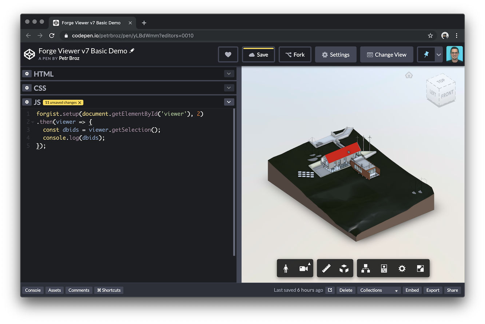
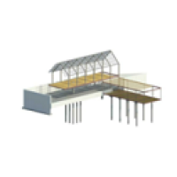
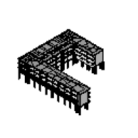
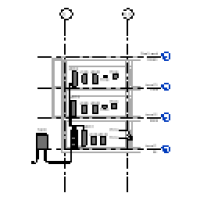
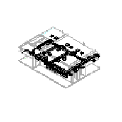

# forgist

[Autodesk Forge](https://forge.autodesk.com) application providing authentication,
sample data, and client side utilities for various code snippet websites
such as [jsfiddle](https://jsfiddle.net) or [codepen](https://codepen.io).

> If you're interested in seeing additional APIs and models other than those listed below,
> submit a [feature request](https://github.com/petrbroz/forgist/issues/new).



## Endpoints

### GET /api/token

Returns a 2-legged OAuth token with `viewables:read` scope.

#### Request

`GET https://forgist.herokuapp.com/api/token`

#### Response

```json
{
    "access_token": "<access-token>",
    "expires_in": <expiration-time-in-seconds>
}
```

### GET /api/models

Returns a collection of sample models ready for viewing.

#### Request

`GET https://forgist.herokuapp.com/api/models`

#### Response

```json
[
    {
        "name": "<name-of-model>",
        "urn": "<model-urn>"
    },
    {
        "name": "<name-of-model>",
        "urn": "<model-urn>"
    },
        {
        "name": "<name-of-model>",
        "urn": "<model-urn>"
    }
]
```

## Client Utilities

When writing a code snippet, you would typically initialize the viewer and load models
using the official [Forge Viewer APIs](https://forge.autodesk.com/en/docs/viewer/v7/reference).
In cases where you don't want to set things up manually, consider using the utility script
https://forgist.herokuapp.com/client/utils.js. It adds a `forgist` object into the global scope
with several helper functions, for example, a `setup` function which automatically initializes
the viewer in provided HTML element, and loads one of the predefined models either by its name or index:

```js
forgist.setup(document.getElementById('viewer'), 2).then(viewer => {
  const dbids = viewer.getSelection();
  console.log(dbids);
});
```

Oh, and here's a quick link to [Create New Codepen](https://codepen.io/pen?template=yLBdWmm) with this snippet.

> See code comments in https://forgist.herokuapp.com/client/utils.js for more details and usage examples.

## Models

| Thumbnail | Name | Credit |
| --------- | ---- | ------ |
|  | rac_basic_sample_project.rvt | [Autodesk Revit 2019 sample files](https://knowledge.autodesk.com/support/revit-products/getting-started/caas/CloudHelp/cloudhelp/2019/ENU/Revit-GetStarted/files/GUID-61EF2F22-3A1F-4317-B925-1E85F138BE88-htm.html) |
|  | rac_advanced_sample_project.rvt | [Autodesk Revit 2019 sample files](https://knowledge.autodesk.com/support/revit-products/getting-started/caas/CloudHelp/cloudhelp/2019/ENU/Revit-GetStarted/files/GUID-61EF2F22-3A1F-4317-B925-1E85F138BE88-htm.html) |
|  | rst_basic_sample_project.rvt | [Autodesk Revit 2019 sample files](https://knowledge.autodesk.com/support/revit-products/getting-started/caas/CloudHelp/cloudhelp/2019/ENU/Revit-GetStarted/files/GUID-61EF2F22-3A1F-4317-B925-1E85F138BE88-htm.html) |
|  | rst_advanced_sample_project.rvt | [Autodesk Revit 2019 sample files](https://knowledge.autodesk.com/support/revit-products/getting-started/caas/CloudHelp/cloudhelp/2019/ENU/Revit-GetStarted/files/GUID-61EF2F22-3A1F-4317-B925-1E85F138BE88-htm.html) |
|  | rme_basic_sample_project.rvt | [Autodesk Revit 2019 sample files](https://knowledge.autodesk.com/support/revit-products/getting-started/caas/CloudHelp/cloudhelp/2019/ENU/Revit-GetStarted/files/GUID-61EF2F22-3A1F-4317-B925-1E85F138BE88-htm.html) |
|  | rme_advanced_sample_project_.rvt | [Autodesk Revit 2019 sample files](https://knowledge.autodesk.com/support/revit-products/getting-started/caas/CloudHelp/cloudhelp/2019/ENU/Revit-GetStarted/files/GUID-61EF2F22-3A1F-4317-B925-1E85F138BE88-htm.html) |